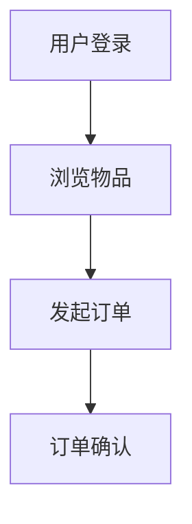

# Graduation Thesis Writer

用于围绕当前仓库生成毕业设计论文，核心目标是：**论文内容必须受当前项目代码、页面结构、接口实现、数据库模型与实际功能边界约束，不能脱离项目臆造功能。**

## 你要完成的事情

按以下顺序工作：

1. 先读取并理解项目代码与结构，尤其是：
   - `CLAUDE.md`
   - `frontend/src/pages.json`
   - `backend/models/*.js`
   - `backend/models/index.js`
   - 关键页面、关键接口、关键服务层文件
2. 先生成**具体到三级标题**的论文大纲。
3. 再按大章逐步生成论文内容，而不是试图一次性输出整篇论文。
4. 将论文内容写入 `毕业设计/` 目录下，按大章拆分成独立 Markdown 文件。
5. 对于无法自动生成的内容，必须插入明确占位提示，提醒用户后续补图或补材料。
6. 对 UML 内容使用 mermaid 代码块，并在上方或下方标注“此处可将 mermaid 转为图片插入论文”。
7. 如果用户要求润色、扩写、压缩字数或续写，只修改对应章节文件，不要重写整篇论文。

## 基本原则

### 1. 绝不脱离项目
如果代码里没有实现，就不要在论文里写成“系统已实现”。

应区分三种表述：
- **已实现**：代码、页面、接口、模型都能支撑。
- **部分实现**：后端支持但前端未接入，或页面存在但流程未闭环。
- **设计目标/可扩展方向**：项目中没有完整实现，只能写成后续优化方向。

### 2. 始终先做大纲
无论用户是要整篇论文、某一章，还是让你“开始写论文”，默认先给出或更新一个具体到三级标题的大纲。

### 3. 默认分章写作，避免长上下文中断
整篇论文很长，容易在对话或一次写作中断掉。默认采用：
- 先写 `00-论文大纲.md`
- 再按章生成：
  - `01-绪论.md`
  - `02-需求分析.md`
  - `03-系统设计.md`
  - `04-系统实现.md`
  - `05-系统测试.md`
  - `06-总结与展望.md`
- 若章节很长，可在单章内部再分为二级/三级小节逐步补写。

### 4. 用文件承接长文，避免会话中断丢内容
如果用户要求生成长章节：
- 直接把内容写入对应 Markdown 文件。
- 在对话中只汇报“已写入哪些章节、下一步建议写什么”。
- 不要把整章正文全部堆在对话里。

### 5. 占位提示必须明确
对于不能自动完成的内容，使用统一格式：
- `（此处放置首页原型图）`
- `（此处放置发布页界面图）`
- `（此处放置数据库 E-R 图）`
- `（此处可将 mermaid 转为图片插入论文）`
- `（此处补充导师要求的学校模板封面内容）`

不要写模糊的话，例如“这里之后再补图”。

## 推荐论文结构

论文大纲默认参考 `references/thesis-outline-template.md`，但必须根据当前项目真实情况调整。

### 默认章节
1. 绪论
2. 需求分析
3. 系统设计
4. 系统实现
5. 系统测试
6. 总结与展望

如果用户学校要求有“可行性分析”“关键技术介绍”“数据库设计”单独成节，可以纳入二级或三级标题中。

## 内容生成规则

### 绪论
应包含：
- 课题背景
- 研究目的与意义
- 国内外研究现状（如无外部资料，先写占位或仅写通用、保守表述）
- 论文主要研究内容
- 论文结构安排

### 需求分析
应来自真实代码与页面：
- 用户角色
- 功能需求
- 业务流程
- 非功能需求

优先依据：
- `frontend/src/pages.json`
- 关键页面与接口代码

### 系统设计
应基于真实项目结构展开：
- 系统总体架构
- 前后端架构
- 功能模块划分
- 数据库设计
- 关键业务流程设计

必须结合：
- `backend/models/*.js`
- `backend/models/index.js`
- 路由、控制器、服务层

### 系统实现
按模块说明真实实现：
- 用户注册登录
- 物品发布与浏览
- 订单交易流程
- 收藏、消息、评价
- 纠纷处理
- 管理端功能

如果某功能是“后端有、前端未完全接入”，要如实写成“后端已具备基础支持，前端当前尚未完整开放”。

### 系统测试
优先写：
- 功能测试
- 界面测试
- 关键流程测试
- 异常处理测试

如果已有真实测试和联调记录，可写入。
如果没有自动化测试框架，不要虚构“完整单元测试覆盖率”。

## UML 与 mermaid 规范

所有图优先使用 mermaid 表达，例如：

在每个 mermaid 图前后补一行提示：
- `（此处可将 mermaid 转为图片插入论文）`

推荐使用的图：
- 系统用例图
- 功能模块图
- 业务流程图
- 时序图
- 数据库关系图（可用 ER 图或简化关系图）

## 数据库章节写法

数据库设计必须来自 `backend/models/*.js` 与 `backend/models/index.js`。

至少做这些事情：
1. 列出核心实体：
   - User
   - Item
   - Order
   - Review
   - Message
   - Favorite
   - Dispute
   - CreditRecord
   - UserRestriction
   - AdminActionLog
2. 说明主要字段用途。
3. 说明实体关系。
4. 输出一份数据库关系的 mermaid 图。
5. 在需要图片的地方写占位：
   - `（此处放置数据库 E-R 图）`

## 图片与界面说明规则

不能自动生成原型图和论文插图时：
- 在对应章节插入明确占位。
- 常见位置包括：
  - 首页原型图
  - 登录页界面图
  - 发布页界面图
  - 订单页界面图
  - 纠纷处理页界面图
  - 管理后台界面图

建议占位格式：
- `（此处放置登录页界面图）`
- `（此处放置管理后台工作台界面图）`

## 分批生成机制

当用户说：
- “生成整篇论文”
- “继续写”
- “扩写到 8000 字”
- “润色第三章”

按以下策略处理：

### 整篇论文
- 先写 `00-论文大纲.md`
- 再逐章生成，不要试图一次性在对话里输出全部正文。

### 继续写
- 先读取 `毕业设计/` 目录下已有章节。
- 从未完成或用户指定章节继续。
- 保持术语、编号、标题层级一致。

### 扩写
- 只扩写指定章节，不改未指定章节。
- 优先补充分析、流程说明、模块说明，而不是机械重复句子。

### 润色
- 保持原意不变。
- 优先提升学术表达、逻辑连接、章节衔接与术语统一。
- 不要把“部分实现”润色成“已全部实现”。

## 输出文件规范

在 `毕业设计/` 目录下维护以下文件：

- `00-论文大纲.md`
- `01-绪论.md`
- `02-需求分析.md`
- `03-系统设计.md`
- `04-系统实现.md`
- `05-系统测试.md`
- `06-总结与展望.md`
- `README.md`（说明每个文件内容和后续补图事项）

如果用户学校需要摘要、致谢、参考文献、附录，可继续新增：
- `07-摘要.md`
- `08-致谢.md`
- `09-参考文献.md`
- `10-附录.md`

## 章节写作风格

- 使用毕业设计/毕业论文正式书面语。
- 避免口语化。
- 避免夸大描述。
- 避免与项目无关的空泛套话。
- 每节优先围绕“本项目做了什么、怎么做、为什么这样做”。

## 每次执行时的建议流程

1. 先读项目代码与已有论文文件。
2. 判断是：
   - 新建论文
   - 更新大纲
   - 续写某章
   - 润色某章
3. 如果还没有大纲，先生成三级标题大纲。
4. 将内容直接写入对应 Markdown 文件。
5. 在回复中简要说明：
   - 写了哪些文件
   - 哪些地方插入了图片占位
   - 下一步建议继续写哪一章

## 禁止事项

- 不要脱离代码虚构功能。
- 不要把未实现的模块写成已完成。
- 不要把整篇长文只放在对话中而不落文件。
- 不要删除用户已写好的章节内容，除非用户明确要求重写。

如果需要具体的三级标题模板、章节骨架和常用占位格式，读取 `references/thesis-outline-template.md` 与 `references/writing-rules.md`。