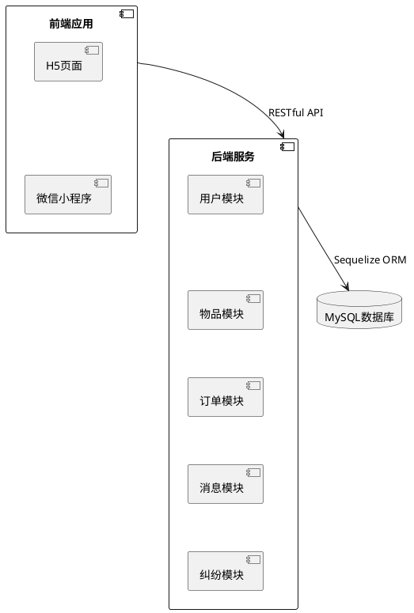
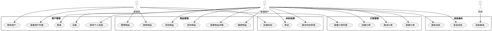
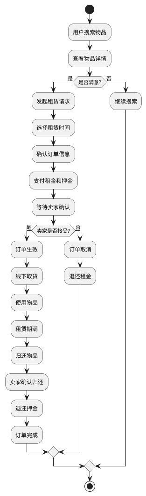
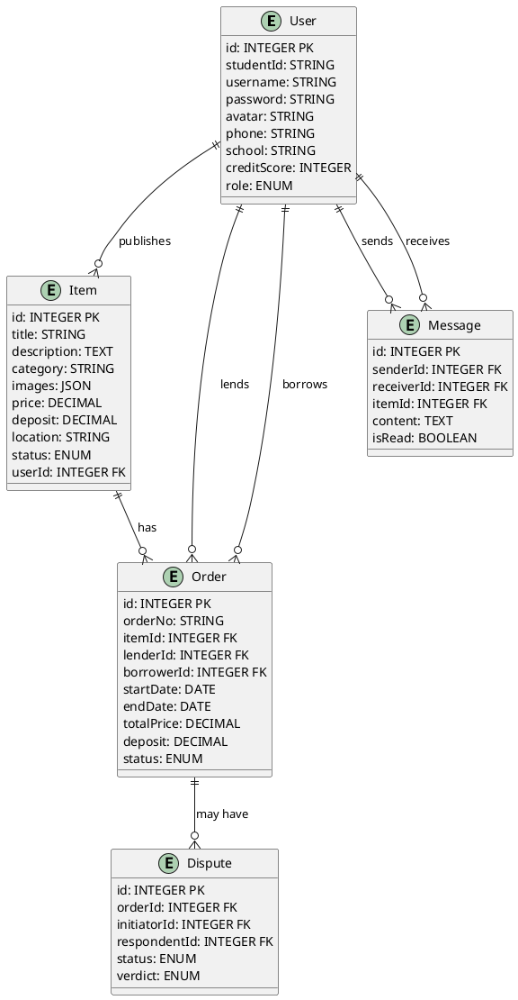

# 第三章 分析设计

## 3.1 系统架构

校园闲置物品共享平台采用前后端分离的架构设计，前端负责用户界面展示和交互逻辑，后端负责业务逻辑处理和数据存储。

前端基于 uni-app 框架开发，通过 RESTful API 与后端进行数据交互。前端应用支持多端发布，包括 H5 和微信小程序，用户可以通过手机浏览器或微信小程序访问平台。

后端基于 Node.js 和 Express.js 框架构建，提供 RESTful API 接口供前端调用。后端服务器接收前端请求，处理业务逻辑，与数据库进行交互，返回处理结果给前端。

数据库采用 MySQL 存储数据，使用 Sequelize ORM 框架进行数据库操作。数据库中存储用户信息、物品信息、订单信息、消息信息、纠纷信息等数据。

系统架构可以用以下 UML 组件图表示（可将下方代码复制到 [PlantText](https://www.planttext.com/) 生成图形）：



## 3.2 产品结构

平台的产品结构主要包括用户端和管理端两部分。

用户端面向普通学生用户，提供物品浏览、搜索、发布、租赁等功能。用户可以通过首页浏览推荐物品，通过搜索功能查找所需物品，查看物品详情后发起租赁请求。用户还可以管理自己发布的物品、查看订单状态、与其他用户进行消息沟通。

管理端面向平台管理员，提供用户管理、物品审核、订单管理、纠纷处理等功能。管理员可以查看和管理用户信息，审核用户发布的物品，处理用户提交的纠纷申请，维护平台的正常运行。

产品结构可以用以下 UML 包图表示（可将下方代码复制到 [PlantText](https://www.planttext.com/) 生成图形）：

```plantuml
@startuml
package "用户端" {
  package "首页" {
    [推荐物品列表]
    [搜索功能]
    [分类导航]
  }
  
  package "物品管理" {
    [物品发布]
    [物品编辑]
    [物品详情]
    [我的发布]
  }
  
  package "订单管理" {
    [订单列表]
    [订单详情]
    [创建订单]
  }
  
  package "消息中心" {
    [消息列表]
    [消息详情]
    [发送消息]
  }
  
  package "个人中心" {
    [个人信息]
    [我的收藏]
    [我的评价]
    [纠纷处理]
  }
}

package "管理端" {
  package "用户管理" {
    [用户列表]
    [用户详情]
    [用户审核]
  }
  
  package "物品管理" {
    [物品审核]
    [物品管理]
  }
  
  package "订单管理" {
    [订单列表]
    [订单详情]
  }
  
  package "纠纷管理" {
    [纠纷列表]
    [纠纷处理]
  }
}
@enduml
```

## 3.3 分析建模

### 3.3.1 用例分析

平台的主要参与者包括普通用户、管理员和系统。

普通用户可以进行注册、登录、浏览物品、搜索物品、发布物品、租赁物品、管理订单、发送消息、处理纠纷等操作。

管理员可以进行用户管理、物品审核、订单管理、纠纷处理等操作。

系统负责数据存储、消息推送、定时任务等功能。

用例图可以用以下代码表示（可将下方代码复制到 [PlantText](https://www.planttext.com/) 生成图形）：



### 3.3.2 活动分析

以物品租赁流程为例，活动图可以用以下代码表示（可将下方代码复制到 [PlantText](https://www.planttext.com/) 生成图形）：



## 3.4 原型设计

平台的原型设计遵循简洁、直观的原则，注重用户体验。

首页采用瀑布流布局展示推荐物品，顶部设有搜索框和分类导航，方便用户快速查找所需物品。物品卡片展示物品图片、名称、价格和发布者信息，点击卡片可查看物品详情。

物品详情页展示物品的详细信息，包括多张图片、描述、价格、押金、租赁规则等，用户可以在此发起租赁请求或收藏物品。

订单列表页按状态分类展示用户的订单，包括待确认、使用中、已完成等状态，用户可以点击订单查看详情或进行相应操作。

个人中心页展示用户的基本信息，包括头像、昵称、诚信分等，提供发布物品、查看订单、消息中心、收藏列表等入口。

管理后台采用侧边栏导航，包含用户管理、物品管理、订单管理、纠纷管理等模块，方便管理员进行各项管理操作。

## 3.5 数据库设计

### 3.5.1 实体关系

平台的数据库包含多个实体，主要包括用户、物品、订单、消息、收藏、评价、纠纷等。

用户实体包含用户的基本信息，如学号、用户名、密码、头像、手机号、学校、专业、诚信分等。用户可以发布多个物品，拥有多个订单（作为借出者或借用者），发送和接收多条消息，收藏多个物品，发表多个评价。

物品实体包含物品的基本信息，如标题、描述、分类、图片、价格、押金、位置、状态等。物品属于一个用户（发布者），可以被多个用户收藏，产生多个订单。

订单实体包含订单的基本信息，如订单编号、物品ID、借出者ID、借用者ID、租赁时间、租金、押金、状态等。订单关联一个物品、一个借出者和一个借用者，可能产生一个纠纷。

消息实体包含消息的基本信息，如发送者ID、接收者ID、物品ID、内容、类型、是否已读等。消息关联发送者和接收者，可能关联一个物品。

纠纷实体包含纠纷的基本信息，如订单ID、发起者ID、被申请人ID、状态、双方陈述、证据图片、裁决结果等。纠纷关联一个订单和相关用户。

实体关系图可以用以下代码表示（可将下方代码复制到 [PlantText](https://www.planttext.com/) 生成图形）：



### 3.5.2 数据表设计

用户表（users）包含用户的基本信息，字段包括 id、studentId、username、password、avatar、phone、qq、email、school、major、creditScore、isViolationUser、status、role 等。

物品表（items）包含物品的基本信息，字段包括 id、title、description、category、images、price、deposit、transactionType、salePrice、location、status、viewCount、userId 等。

订单表（orders）包含订单的基本信息，字段包括 id、orderNo、itemId、lenderId、borrowerId、startDate、endDate、totalDays、totalPrice、deposit、note、pickupLocation、returnLocation、status、pickupCode、returnCode 等。

消息表（messages）包含消息的基本信息，字段包括 id、senderId、receiverId、itemId、content、type、isRead 等。

纠纷表（disputes）包含纠纷的基本信息，字段包括 id、orderId、itemId、borrowerId、lenderId、initiatorId、respondentId、status、initiatorStatement、respondentStatement、adminId、verdict、resolutionNote 等。

## 3.6 接口设计

### 3.6.1 用户接口

用户注册接口：POST /api/auth/register，接收用户名、密码、手机号等参数，返回注册结果。

用户登录接口：POST /api/auth/login，接收用户名和密码，返回用户信息和 token。

获取用户信息接口：GET /api/users/me，返回当前登录用户的信息。

更新用户信息接口：PUT /api/users/me，接收用户信息，更新用户资料。

### 3.6.2 物品接口

发布物品接口：POST /api/items，接收物品信息和图片，创建新物品。

获取物品列表接口：GET /api/items，支持分页和筛选，返回物品列表。

获取物品详情接口：GET /api/items/:id，返回指定物品的详细信息。

更新物品接口：PUT /api/items/:id，更新物品信息。

删除物品接口：DELETE /api/items/:id，删除指定物品。

### 3.6.3 订单接口

创建订单接口：POST /api/orders，接收物品ID、租赁时间等参数，创建新订单。

获取订单列表接口：GET /api/orders，支持按状态筛选，返回订单列表。

获取订单详情接口：GET /api/orders/:id，返回指定订单的详细信息。

更新订单状态接口：PUT /api/orders/:id/status，更新订单状态。

取消订单接口：DELETE /api/orders/:id，取消指定订单。

### 3.6.4 消息接口

获取消息列表接口：GET /api/messages，返回当前用户的消息列表。

发送消息接口：POST /api/messages，接收接收者ID和内容，发送消息。

标记消息已读接口：PUT /api/messages/:id/read，标记消息为已读。

### 3.6.5 纠纷接口

提交纠纷申请接口：POST /api/disputes，接收订单ID和陈述内容，创建纠纷申请。

获取纠纷列表接口：GET /api/disputes，返回当前用户的纠纷列表。

获取纠纷详情接口：GET /api/disputes/:id，返回指定纠纷的详细信息。

提交证据接口：PUT /api/disputes/:id/evidence，提交纠纷证据。

管理员处理纠纷接口：PUT /api/disputes/:id/resolve，处理纠纷并给出裁决结果。
